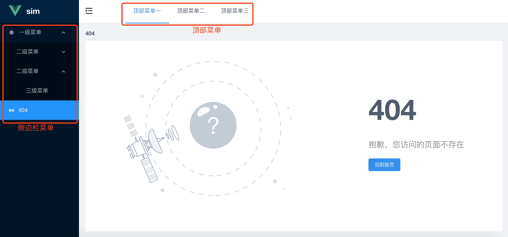

# 路由与导航

为了方便配置，将网站导航与路由的配置放在 src/menu-router.js 中一起处理，下面结合该文件简单介绍菜单与路由的几个概念。

### 导航
导航是指各个页面的入口链接聚集区域，关注的是链接文案和 URL，分为 顶部菜单(导航) 和 侧边栏菜单(导航) 两部分。



1. 顶部导航，在 headerMenuData 中定义。  
2. 侧边栏导航 由两部分组合而成，一是预留在SSO系统中配置的页面，有菜单项权限管理，二是开发者代码定义的菜单项。
    - 对于在 SSO 中配置的页面，需要通过 DataFactory 函数处理成标准数据结构，并在 ssoRouterComponent 中指定路由规则（uri 对应的 vue component）。  
    - 对于开发者代码定义的导航，直接在 customSidebarMenuRouters 中进行配置。

### 路由
> 使用 [Vue-router](https://router.vuejs.org/zh/api/#routes) 管理路由，可点击链接查看官方文档。

路由，即路由规则，是定义一个 url path 使用哪个页面来渲染的规则，关注的是 path --> component 的映射关系。  
以src/menu-router.js中的 customSidebarMenuRouters 为例，简要介绍如何配置导航和路由。

```
{
  // 下面是导航相关属性
  uri: '/parent'               // 导航项的URL，填写基于域名的根路径格式。 uri 缺省时会使用 path 的值
  describe: 'front end',       // 导航项的文案
  icon: 'ios-recording',       // 导航项的icon，从http://v3.iviewui.com/components/icon 中选择
  // 下面是路由相关属性
  path: '/parent',             // 路由匹配的路径，vue-router 属性
  component: ParentPage,       // 路由匹配的页面，，vue-router 属性
  children: [                  // 嵌套路由，子菜单，，vue-router 属性
    {
      path: 'firstchild',          // 实际的 path ，被因为嵌套作用变成 /parent/firstchild
      component: ChildPage,
      uri: '/parent/firstchild',
      describe: '普通二级菜单',
      icon: 'ios-recording',
      hide: true,                  // 隐藏该菜单项，默认 false
    },
    {
      path: '',                   // 必须设置一下 path
      linkType: 'a-link',         // 设置外链菜单项
      uri: 'https://www.baidu.com',
      describe: '外链二级菜单',
      icon: 'ios-star',
    },
  ],
}
```

**嵌套路由**
1. 在路由项中设置 children。请注意父路由对应的vue component中必须要有`<router-view><router-view/>`才能渲染出子路由的 vue component。
    请参考 src/pages/parent-pages/index.vue
2. path 代表 路由路径，当以 ' / ' 开头时会被当作绝对路径，反之则是相对路径。uri 代表导航项的跳转地址，请填写根路径。

**使用外链**  
当需要设置外链菜单项时，需要设置 `path = ''`，因为 Vue-router 中，path 是必须配置的，尽管对于外链菜单项而言，path 毫无意义。   
点击外链菜单项默认将在当前窗口打开新页面。

### 新增一个页面
第一步：在 /src/pages/ 里增加一个页面，比如增加 new 这个页面，按照目录结构规范添加文件夹 new，并在该文件夹下添加文件 index.vue和 index.less。  
第二步：在 /src/menu-router.js 文件的顶部引入该文件（component）。  
`import NewPage from './pages/new/index.vue';`  
第三步：  
方式一，自定义菜单项  
在 customSidebarMenuRouters 中增加新页面，如下所示。
```
{
    path: '/newpage',
    component: NewPage,
    describe: '新的一页',
    icon: 'ios-star',
},
```
方式二，预留的 sso 菜单项，比如希望控制没权限的人不显示这个菜单项的情况

在 ssoRouterComponent 中，为 sso 菜单数据的uri指定该页面。请不要在factory.updateHideItems中隐藏该菜单与其父菜单项。  
```
const iamRouterComponent = {
    '/': TestPage,
    '/demopage': NewPage,     // 为 uri = '/demopage' 的 iam 菜单指定 NewPage 页面
};
```

关于DataFactory的三种方法，可以通过下面的示例了解更多信息。
```
factory.updateHideItems(['/user/develop-test'])                // uri 为 /#/user/develop-test 的菜单隐藏
    .updateLinkItems('a-link', ['/user/develop0-test'])         // uri 为 /#/user/develop0-test 的菜单跳转链接为外联 a-link ，其他的链接跳转均为 router-link
    .updateOpenItems(['业务监控'])                               // describe 为 业务监控 的菜单栏展开
    .generateRoutes(routerComponent);                           // 自动注册路由
```

### 单页面应用
应用是基于 Vue-router hash 模式的单页面应用，相比传统的前端页面，单页面的优势在于一次性加载，体验更流畅。而传统意义上的路由在 此应用 中实际对应的是一个 Hash 地址。  
比如在 http://localhost:3333/#/charts 中，/charts 就是 hash 地址。页面实际上始终都没有进行跳转，只是根据不同的 hash 去渲染不同的 Vue 组件。
