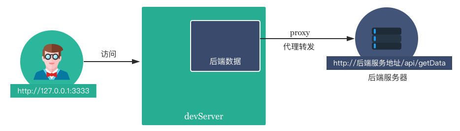

# 跨域问题

> 浏览器安全的基石是"同源政策"，即 协议，域名，端口 均相同。当页面请求「不同源」的资源时，必须解决跨域问题（又叫跨域资源共享）。

解决这个问题的思路是，将不同源的服务通过代理收敛到同源，从根本上避免了同源策略的干扰。  
具体来说，又分为本地开发 与 服务部署到测试线上后两种情况。  
在本地开发环境，以前端服务为入口，使用 webpack devServer 启动前端服务器，并使用它的 proxy 功能将后端请求转发至真实的服务地址。  
在测试和线上环境，可以以 Java 服务为入口，在java项目内进行识别出前端资源的请求转发至前端服务器(使用nginx提供服务)。

### 本地开发环境



1. 打开 /compile/config.dev.js ，proxy 部分就是本地开发时的代理配置。

2. 将 /xxxx-gateway/api/v1/ 设置为待匹配的接口前缀，将 target 字段设置为后端服务地址。

3. 配置修改后请 重新运行 项目，代理才能生效。

下面代码的含义是，如果请求前缀是 /xxxx-gateway/api/v1/，则把这个接口转发到 http://127.0.0.1:8080下。

```
module.exports = {
  proxy: {
    '/xxxx-gateway/api/v1/': {            // 要进行代理的接口前缀
      target: 'http://127.0.0.1:8080/',   // 要代理到的服务地址
      logLevel: 'debug',
      changeOrigin: true,
    },

    '/ssoagentlogin': {                   // 配置 iam 类接口
      target: '',                         // 如果 Java 应用集成 IAM sdk，然后直接填写该 Java 服务地址即可
      logLevel: 'debug',
      changeOrigin: true,
      cookieDomainRewrite: {              // 改写 http 响应头 set-cookie 中的 domain 值
        '*': '',
      },
    },
  },
};
```

proxy 的所有配置项，可以点击 [devServer.proxy](https://webpack.js.org/configuration/dev-server/#devserver-proxy) 以及 [http-proxy-middleware](https://github.com/chimurai/http-proxy-middleware) 了解。

### 测试和线上环境
在java项目内代码逻辑进行识别出前端资源的请求转发至前端服务器。直接通过Java服务地址来访问前端服务如：http://xxxx-gateway.com/index.html，由于接口与页面同域，天然没有跨域限制。