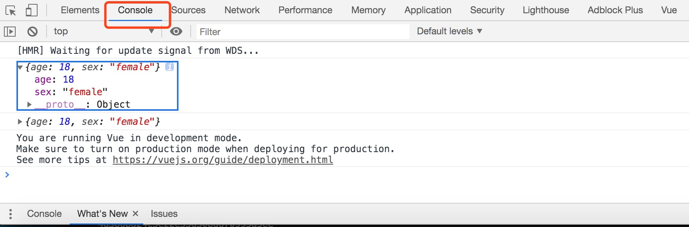
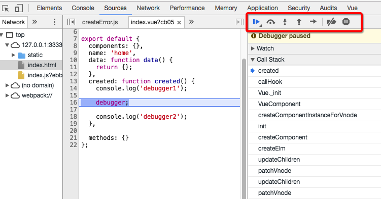
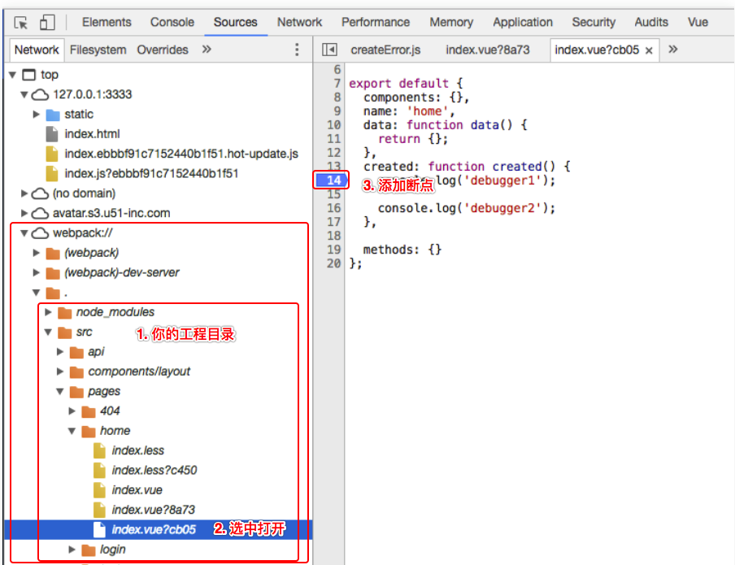
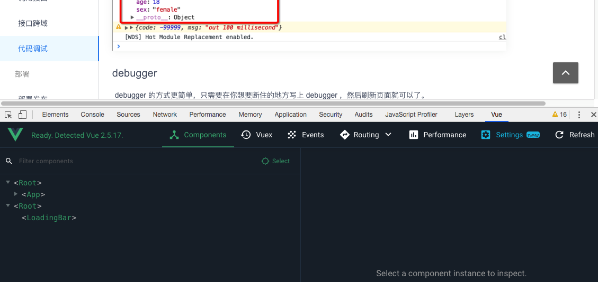

# 代码调试

调试代码是开发过程中必不可少的一个环节，下面介绍几个常用的调试方法。

### console.log
这种方式是我们日常开发中最常用也最简单的方式，在你需要知道这个变量的值，console.log 将变量值输出在控制台上即可。
```
const user = {
  age: 18,
  sex: 'female',
};
console.log(user);
```
打开浏览器，右键，选择检查，切换到 console tab，就可以看到对应的值打印了出来。




### debugger
debugger 的方式更简单，只需要在你想要断住的地方写上 debugger ，然后刷新页面就可以了。
```
created() {
  console.log('debugger1');

  debugger;
  
  console.log('debugger2');
},
```

如上图，在写了 debugger 的地方就会中断，点击红框里几个按钮就可以继续往下走，具体每个功能，就靠自己去发现了~

### SourceMap
如下图，在控制台切换到 source tab ，在左边侧边栏寻找 .webpack ，再找到源码的对应文件，在右侧点击需要观察的代码所在的行，就可以达到跟上面 debugger 一样的效果，在刷新页面执行到此处时就会中断。



### Vue.js devtools
chrome 下可以安装 [vue.js devtools](https://chrome.google.com/webstore/detail/vuejs-devtools/nhdogjmejiglipccpnnnanhbledajbpd)，在本地开发时（npm run dev），打开 chrome 开发者工具，会自动出现 Vue 的 tab，在 Vue tab 中可以使用 Vue 相关的调试功能。

