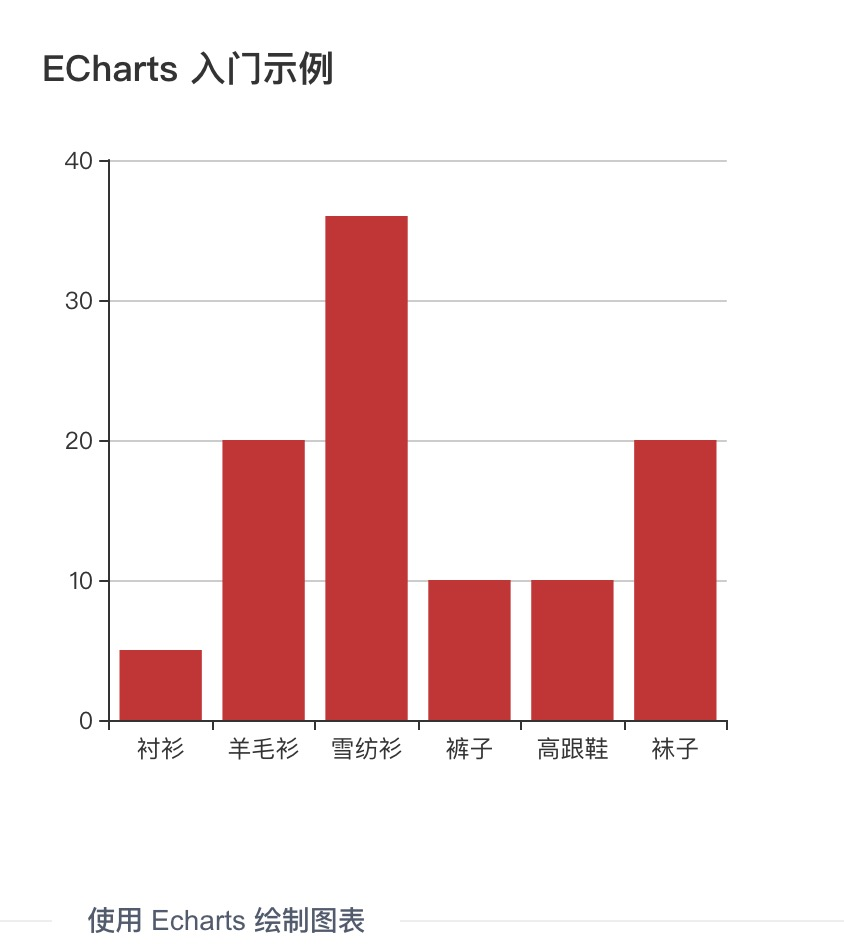

# Chart 
图表的使用可以参考示例中的相关模块，以下是引入和简单使用 ECharts 的示例。

### 安装 Echarts
在项目根目录执行命令 nbm install echarts --save 安装 echarts 包

### 引用 Echarts
直接在项目代码中引入 Echarts 即可

```
/* 全量引入，推荐 */
import echarts from 'echarts/index.js';

/* 按需引入*/
import  echarts  from 'echarts/lib/echarts';
import 'echarts/lib/chart/bar';                 // 引入柱状图
import 'echarts/lib/component/tooltip';         // 引入提示框
import 'echarts/lib/component/title';           // 引入标题组件
```

### 代码实例
以创建一个柱状图为例，绘制图表需要一个 dom 节点(建议使用 div 并指定高度)，然后传入绘制所需要的 options 就可以了。 可以在 Echarts 官网找到更多 [相关的示例](http://echarts.baidu.com/examples/) 。

```
<template>
  <div>
    <div id="chart"></div>
  </div>
</template>
<script>
import echarts from 'echarts/index.js';

export default {
  components: {
  },
  name: 'home',
  data() {
    return {};
  },
  created() {
  },
  methods: {
    draw() {
      // 基于准备好的dom，初始化echarts实例
      const myChart = echarts.init(document.getElementById('chart'));
      // 绘制图表
      myChart.setOption({
        title: {
          text: 'ECharts 入门示例',
        },
        tooltip: {},
        xAxis: {
          data: ['衬衫', '羊毛衫', '雪纺衫', '裤子', '高跟鞋', '袜子'],
        },
        yAxis: {},
        series: [{
          name: '销量',
          type: 'bar',
          data: [5, 20, 36, 10, 10, 20],
        }],
      });
    },
  },
  mounted() {
     this.draw();
  },

};
</script>
<style>
#chart {
  width: 200px;
  height: 200px
}
</style>
```


### 统一配色
可以根据我们自己的 配色方案 在 options 上增加全局调色盘，Echarts 会自动选用其中的配色。

```
myChart.setOption({
  // 全局调色盘。
  color: [
    '#2F8DFA',
    '#1FD0BF',
    '#EB648B',
    '#F8C753',
    '#EB7E30',
    '#A93790',
    '#049587',
    '#1553B6',
    '#55008C',
    '#8B572A',
  ],
});
```