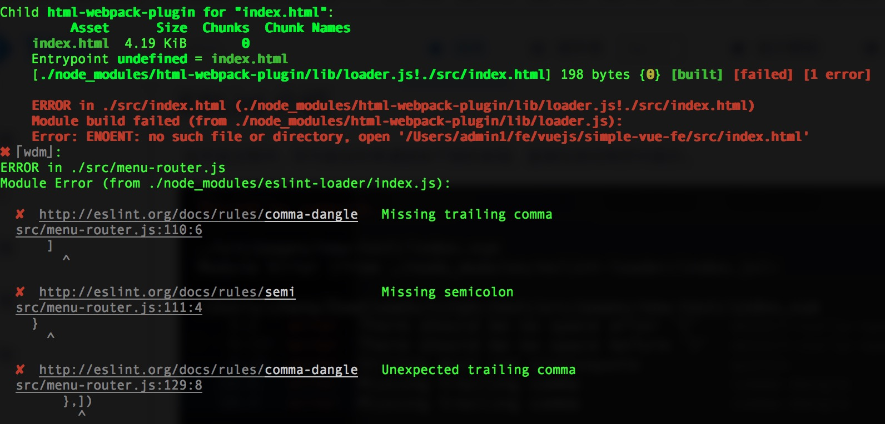
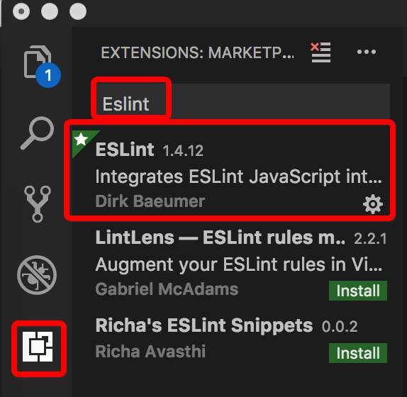
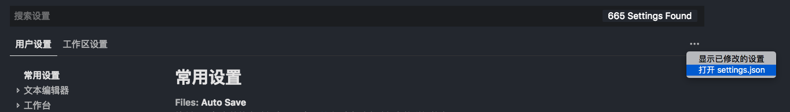

# ESLint 介绍

在开发过程中，你可能会时常遇到如下图的报错，直接在测试网页中提示。



实际上，该问题是由于 JavaScript 代码检查工具 ESLint 对代码进行了严格的格式检查导致的。

### 初识 ESLint

JavaScript 作为一种 轻量级解释型或即时编译型的动态脚本语言 ，往往需要在运行过程中，在浏览器的控制台中发现错误。为了尽可能地减少语法错误、统一编程风格以及提高代码执行效率，在开发过程中就通过代码检查工具检查代码问题，统一编程风格就显得十分重要了。

在 [ESLint](http://eslint.cn/docs/about/) 官网中有这样一段话，摘录在此方便大家理解 ESLint 的作用。

> JavaScript 是一个动态的弱类型语言，在开发中比较容易出错。因为没有编译程序，为了寻找 JavaScript 代码错误通常需要在执行过程中不断调试。像 ESLint 这样的可以让程序员在编码的过程中发现问题而不是在执行的过程中。


### 项目规范

项目引入了 ESLint。在开发过程中，可能会遇到各种各样的 ESLint 报错信息，请根据具体的报错信息进行修改，强烈推荐使用下一章节给出的代码格式化工具自动修复代码。

下面对项目中常见的 ESLint 规范进行说明。

1. Strings must use singlequote.  
在script 标签内的 JS 代码中，字符串必须用'单引号。

2. Missing trailing comma.  
尾后逗号 缺失。在定义对象，函数时，必须添加尾后逗号。
```
export default {
  components: {
    FilterComponent,
    Pagination,             // 尾后逗号
  },
  data() {
    return {
      tableData: {},
      listData: [10, 11],   // 尾后逗号
    }
  },
  methods: {
    async updateData() {},
    onChange(data) {},      // 尾后逗号
  },                        // 此处也有尾后逗号
}
```
3. Expected parentheses around arrow function argument.  
箭头函数的参数必须在括号内。
```
let sayHello = name => `Hello, ${name}`,     // 错误
let sayHello = (name) => `Hello, ${name}`,   // 正确
```
由于 [某些原因](https://vuejs.org/v2/api/#methods)，请不要在 methods 中用箭头函数定义方法。


### 代码格式化工具

#### VSCode 用户
1. 查看项目根目录下有.eslintrc.js文件
2. 点击 VSCode 侧边栏最下方的 扩展，下载 ESLint 插件，安装成功后重新加载 VSCode。


3. 在 VSCode 中通过 `⌘Command + ,` 打开设置页面，点击页面右侧的打开 setting.json。


在页面右侧的用户设置中添加如下代码。

对于1.27.0以下版本，⌘Command + , 会直接打开setting.json，在页面右侧的用户设置中添加代码即可。

```
"eslint.run": "onType",
"eslint.enable": true,
"eslint.autoFixOnSave": true,
"eslint.validate": [
    "javascript",
    "javascriptreact",
    {
        "language": "vue",
        "autoFix": true
    },
    {
        "language": "html",
        "autoFix": true
    }
],
```

4. 完成以上配置后重新加载 VSCode，此时保存文件时就会自动格式化成符合 ESLint 规则的代码。