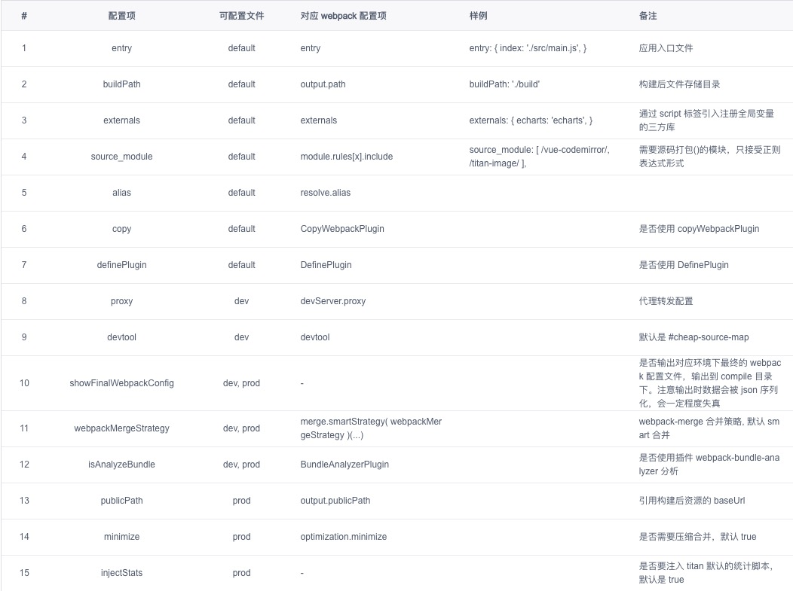

# webpack 配置

### 基础自定义配置
在 /compile/custom 文件夹下的文件中（config.default.js、config.dev.js、config.prod.js）提供了额外的可配置项，可以在对应环境的文件中修改相应配置项，从而达到修改 webpack 配置的目的。

> 这些文件 并非 是 webpack 配置文件，只能配置下面表格提到的配置项。



### 进阶自定义配置

如果上述的配置项不能满足你的要求，需要进一步的自定义 webpack 配置，请在项目的 /compile/custom 文件夹下新建webpack.build.config.js 或webpack.dev.config.js文件，在其中编写对应的 webpack 配置（这两个文件是标准的 webpack 配置文件）。

将利用 [webpack-merge](https://www.npmjs.com/package/webpack-merge) 的merge.smartStrategy()方法对 默认配置文件 和 用户自定义配置文件 进行合并，并将合并结果作为最终的 webpack 配置。

以下是 merge.smartStrategy() 的简单示例。
```
merge.smartStrategy(
  {
    'entry': 'prepend',               // entry 属性的合并策略是 prepend
    'plugins': 'append'             // plugins 属性的合并策略是 append
  }
)(object1, object2, object3, ...); 
```

点击 [webpack-merge](https://www.npmjs.com/package/webpack-merge) 查看相应的文档。使用 webpackMergeStrategy 时推荐将showFinalWebpackConfig 置为 true，查看最终的 webpack 配置文件。


